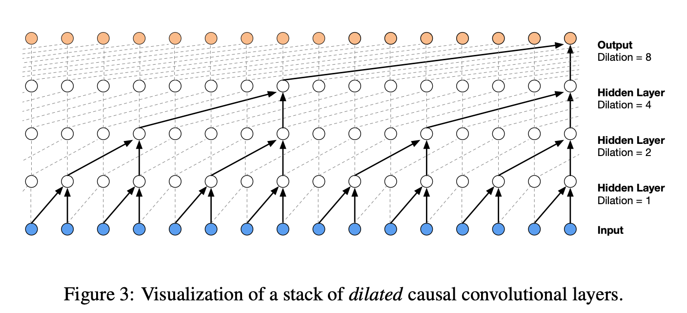

# CharLM

## Index of Implementations
This repository contains multiple implementations of character-level language models:

1. [CharGPT: Transformer-based Character-Level Language Model](#chargpt-transformer-based-character-level-language-model)
2. [WaveNet Architecture based character level language model](#wavenet-character-level-language-model)
   Implementation of WaveNet Model Oord et al (2016) for language modeling. 
3. [Neural Network Character-Level Language Model](#neural-network-character-level-language-model)  
   A neural network implementation of a trigram-based language model inspired by Bengio et al. (2003).  
4. [Trigram Language Model](#trigram-language-model)  
   A statistical model that calculates probabilities using character trigram counts with smoothing.  


---

## CharGPT: Transformer-based Character-Level Language Model  

### Overview  
CharGPT is a character-level language model inspired by OpenAI's GPT architecture. It implements the decoder portion of the Transformer model from *Attention Is All You Need* and is trained on raw text data to generate coherent sequences. The model learns to predict the next character in a sequence, allowing it to generate text in a similar style to its training data.  

### Features  
- Implements a **Transformer decoder** using multi-head self-attention and feed-forward layers.  
- Supports **variable context lengths** for character prediction.  
- Uses **token and positional embeddings** to learn the relationships between characters.  
- Implements **causal self-attention** with a lower triangular mask to prevent peeking at future tokens.  
- Supports **batch processing** and **efficient training** with PyTorch.  
- Includes **a simple text generation function** to sample new sequences from the trained model.  

### Model Architecture  
CharGPT follows a **Transformer decoder-only architecture**, consisting of:  
- **Token Embeddings**: Converts input characters into dense vector representations.  
- **Positional Embeddings**: Provides positional information for character sequences.  
- **Stacked Transformer Blocks**: Each block contains:  
  - Multi-Head Self-Attention with a causal mask.  
  - Feed-Forward Neural Network with ReLU activation.  
  - Layer Normalization and Residual Connections for stable training.  
- **Final Linear Layer**: Maps the output embeddings to vocabulary logits for character prediction.  

### Dependencies  
To run CharGPT, you need the following dependencies installed:  
```bash
pip install torch numpy
```  

## How to Use  
### 1. Clone the repository and navigate to the project directory  
```bash
git clone https://github.com/your-username/CharGPT.git
cd CharGPT
```  

### 2. Train the Model  
Place your training text inside `input.txt`, then run:  
```bash
python train.py
```  

### 3. Generate Text  
Once trained, you can generate text using:  
```python
import torch
from model import GPTLanguageModel, decode

device = 'cuda' if torch.cuda.is_available() else 'cpu'
model = GPTLanguageModel().to(device)
context = torch.zeros((1, 1), dtype=torch.long, device=device)
generated_text = decode(model.generate(context, max_new_tokens=500)[0].tolist())
print(generated_text)
```  

This will output a sequence of characters generated by CharGPT based on its training data.  

---  


## WaveNet Character-Level Language Model

### Overview
This implementation builds a **character-level language model** inspired by the **WaveNet: A Generative Model for Raw Audio** paper by Oord et al. (2016). The model generates sequences at the character level, capturing dependencies between characters using a hierarchical structure with stacked layers. This architecture is adapted to model language rather than raw audio, emphasizing context-based generation and efficient parameter sharing.



### Features
1. **Hierarchical Design**:
   - Processes sequences hierarchically using consecutive character flattening, enabling efficient feature extraction.
2. **Embedding Layer**:
   - Maps characters to dense vector representations.
3. **Feedforward Network with Batch Normalization**:
   - Three hidden layers with Batch Normalization (Ioffe et al., 2015) and Tanh activations for improved training stability and non-linearity.
4. **Scalable Context Windows**:
   - Configurable context window size to process multiple characters simultaneously, simulating receptive field expansion.
5. **Softmax Output**:
   - Predicts the probability distribution over the vocabulary for the next character.

### Model Architecture
The model is implemented as a sequence of modular layers:
- **Embedding Layer**: Maps input indices to dense vectors.
- **FlattenConsecutive**: Flattens adjacent characters into a single input for processing.
- **Linear Layers**: Dense connections with He Initialization (He et al., 2015) for stable training.
- **Batch Normalization**: Normalizes layer outputs for faster convergence.
- **Tanh Activation**: Non-linearity for complex feature representation.
- **Final Linear Layer**: Maps to the vocabulary size for classification.

### Dependencies
- Python 3.8+
- PyTorch
- argparse

Install dependencies using:
```bash
pip install torch
```

### How to Use

#### 1. Prepare Dataset
Create a text file with each line containing a single word or sequence (e.g., `dataset.txt`).

#### 2. Train the Model
Run the following command to train and generate sequences:
```bash
python charlm.py --file_path <path_to_dataset> [options]
```

#### Command-Line Arguments
| Argument          | Description                                                                                 | Default        |
|-------------------|---------------------------------------------------------------------------------------------|----------------|
| `--file_path`     | Path to the text file containing the dataset.                                               | Required       |
| `--epochs`        | Number of epochs to train the model.                                                        | `300000`       |
| `--batch_sz`      | Batch size for training.                                                                    | `32`           |
| `--blr`           | Base learning rate.                                                                         | `0.09`         |
| `--decay`         | Learning rate decay factor applied in the second half of training.                          | `0.1`          |
| `--emd_dim`       | Dimension of character embeddings.                                                          | `20`           |
| `--block_sz`      | Size of the context window (number of preceding characters to consider).                     | `8`            |
| `--n_hidden`      | Number of neurons in the hidden layers.                                                     | `200`          |
| `--n_consecutive` | Number of consecutive characters to process at each stage.                                  | `2`            |
| `--samples`       | Number of generated samples after training.                                                 | `20`           |

#### 3. Output
- The model generates character-level sequences based on the trained distribution.
- Example output:
  ```
  ...
  Generated Samples:
  - jackel.
  - kryston.
  - rio.
  ```

#### 4. Evaluate
The final training and validation losses are displayed during training to assess model performance.

## Neural Network Character-Level Language Model

### Overview
This repository implements a **Neural Network Character-Level Language Model**, inspired by the paper "A Neural Probabilistic Language Model" by Bengio et al. (2003). The model is capable of generating character-level sequences and evaluates their likelihood. It incorporates modern deep learning techniques such as **Batch Normalization** (Ioffe et al., 2015) and **He Initialization** (He et al., 2015).

### Features
1. Implements a multi-layer neural network with:
   - Character embeddings.
   - Fully connected layers with **Batch Normalization**.
   - **Tanh** activations.
2. Supports generating character sequences after training.
3. Uses a flexible architecture for customization of:
   - Embedding dimensions.
   - Number of layers.
   - Hidden layer size.
   - Training epochs and batch size.

### Dependencies
- Python 3.8+
- PyTorch
- argparse

Install dependencies using:
```bash
pip install torch
```

### How to Use

#### 1. Prepare Dataset
Create a text file where each line contains a single word or sequence (e.g., `dataset.txt`).

#### 2. Run the Model
Train the model and generate sequences using the following command:
```bash
python charlm.py --file_path <path_to_dataset> [options]
```

#### Command-Line Arguments
| Argument          | Description                                                                                 | Default        |
|-------------------|---------------------------------------------------------------------------------------------|----------------|
| `--file_path`     | Path to the text file containing the dataset.                                               | Required       |
| `--epochs`        | Number of epochs to train the model.                                                        | `200000`       |
| `--batch_sz`      | Batch size for training.                                                                    | `32`           |
| `--blr`           | Base learning rate.                                                                         | `0.09`         |
| `--decay`         | Learning rate decay factor applied in the second half of training.                          | `0.1`          |
| `--emd_dim`       | Dimension of character embeddings.                                                          | `10`           |
| `--block_sz`      | Size of the context window (number of preceding characters to consider).                    | `3`            |
| `--n_hidden`      | Number of neurons in the hidden layers.                                                     | `100`          |
| `--samples`       | Number of sequences to generate after training.                                             | `20`           |

#### Example
```bash
python charlm.py --file_path dataset.txt --epochs 100000 --batch_sz 64 --n_hidden 128 --samples 10
```

### Model Architecture
The model consists of:
1. **Character Embedding Layer**: Converts each character into a learnable vector of fixed size.
2. **Fully Connected Layers**: Stacked layers with **Batch Normalization** and **Tanh** activation.
3. **Output Layer**: Maps the final layer's output to vocabulary logits using a fully connected layer.

### Initialization
- **Weights** are initialized using **He Initialization** (He et al., 2015) for deep networks.
- The output layer's gamma parameter is scaled down to improve training stability.

### Loss Function
The model uses **Cross-Entropy Loss** to optimize the prediction of the next character in the sequence.

### Output
1. **Training Metrics**:
   - Logs the loss at regular intervals during training.
   - Final training and validation losses are displayed after training.
2. **Generated Sequences**:
   - Produces character sequences based on the trained model.
   - The sequences terminate when a special end-of-sequence token (e.g., `.`) is encountered.

### Example Output
```
Training Started
47551
Step: 0 || Loss: 3.3162782192230225
Step: 10000 || Loss: 2.4418375492095947
Step: 20000 || Loss: 2.2259957790374756
...
Step: 190000 || Loss: 1.9431310892105103
Final Train Loss: 1.9700287580490112
Final Val Loss: 2.3015241622924805
Time taken for training: 831.7610
tianna.
vya.
brie.
athi.
blisha.
...
```

## Trigram Language Model

### Overview
This is the first part of `CharLM`, trigram-based character-level language model designed to generate sample names and evaluate probabilities of sequences in a dataset. The model supports **two training methods**:
1. **Count-based Trigram Model**: A statistical model based on counts of character trigrams.
2. **Neural Network-based Trigram Model**: A deep learning model trained using one-hot encoding of character pairs and a linear transformation.

The model generates synthetic names based on learned probabilities and evaluates the dataset using **negative log likelihood**.


### Installation and Usage

#### Dependencies
The code requires the following libraries:
- Python 3.8+
- PyTorch
- argparse

Install PyTorch using:
```bash
pip install torch
```

#### How to Run
1. **Prepare a Text File**:
   - Create a text file where each line represents a word or name (e.g., `names.txt`).

2. **Run the Model**:
   Use the following command to train and evaluate the model:
   ```bash
   python charlm.py --file_path <path_to_file> --method <count/neural> --epochs <num_epochs> --lr <learning_rate>
   ```

   **Example**:
   ```bash
   python charlm.py --file_path names.txt --method neural --epochs 200 --lr 50
   ```

### Arguments
| Argument               | Description                                                                                  | Default       |
|----------------|----------------------------------------------------------------------------------------------|---------------|
| `--file_path`          | Path to the text file containing the dataset.                                                | Required      |
| `--method`             | Training method: `count` for count-based or `neural` for neural network-based training.       | `count`       |
| `--epochs`              | Number of epochs (only for neural network-based training).                                    | `200`         |
| `--lr`                  | Learning rate (only for neural network-based training).                                      | `50`          |

---

### Model Details

#### 1. Count-Based Trigram Model
- **How It Works**:
  - Counts the frequency of each trigram (sequence of three characters).
  - Calculates probabilities with **smoothing** to handle unseen trigrams.
- **Loss Function**:
  - Negative log likelihood of the dataset.

#### 2. Neural Network-Based Trigram Model
- **How It Works**:
  - Uses one-hot encoding of character pairs as input.
  - Learns a weight matrix (`W`) through gradient descent.
- **Loss Function**:
  - Negative log likelihood with L2 regularization.

---

### Output
1. **Training, Validation, and Test Loss**:
   - Displays performance metrics for the model.

2. **Generated Names**:
   - Outputs a list of 10 sample names generated by the trained model.

**Example Output**:
```
--------------------------------
Count Based Training
Train Loss: 2.5634
Val Loss: 2.7104
Test Loss: 2.6851
Sample names generated by the model:
Albina
Bert.
Cora.
Delta.
...
```

---

### References
1. Bengio, Y., et al. (2003). "A Neural Probabilistic Language Model."
2. He, K., et al. (2015). "Delving Deep into Rectifiers: Surpassing Human-Level Performance on ImageNet Classification."
3. Ioffe, S., et al. (2015). "Batch Normalization: Accelerating Deep Network Training by Reducing Internal Covariate Shift."

### License
This project is licensed under the MIT License.
